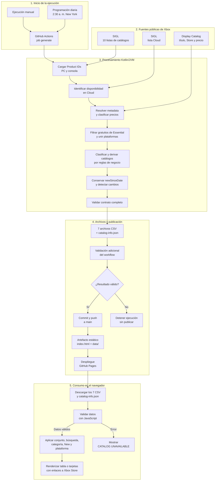
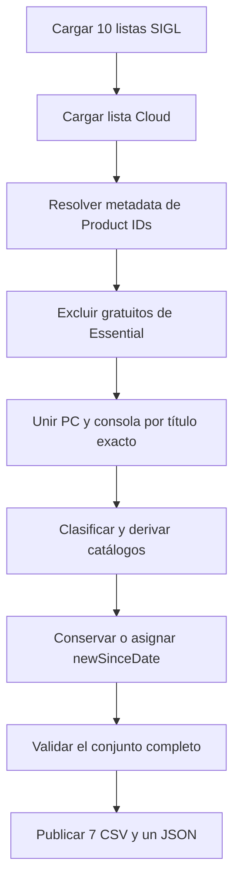

# Documentación técnica y arquitectura

## 1. Propósito del proyecto

Este proyecto obtiene los catálogos públicos de Xbox Game Pass para Estados Unidos, los normaliza, aplica reglas de negocio y publica una vista web estática que permite explorar los juegos por plan, clasificación, plataforma y fecha de incorporación.

El objetivo principal es identificar con claridad qué juegos están en Ultimate y no en Premium, y distinguir dentro de ese conjunto los títulos de EA Play, Ubisoft+ Classics y los verdaderamente exclusivos de Ultimate. El proyecto también mantiene los catálogos completos de Ultimate, Premium y Essential.

La solución se divide en tres partes:

1. Un generador de datos escrito en Kotlin/JVM.
2. Una vista estática escrita en HTML, CSS y JavaScript.
3. Un workflow de GitHub Actions que ejecuta, valida, versiona y publica el resultado en GitHub Pages.

La lógica de negocio vive en Kotlin. La vista consume los archivos ya procesados y no vuelve a calcular las diferencias entre planes.

## 2. Alcance funcional

- Mercado: Estados Unidos (`US`).
- Idioma de los datos: inglés (`en-us`).
- Planes consultados: Ultimate, Premium, Essential, EA Play y Ubisoft+ Classics.
- Capacidades mostradas: consola, PC nativo y Xbox Cloud Gaming.
- Ventana para considerar un juego como nuevo: 20 días.
- Publicación: sitio estático en GitHub Pages.
- Sitio publicado: <https://ninnex.github.io/xbox-gamepass-only-ultimate/>.

## 3. Tecnologías y lenguajes

| Área | Tecnología | Uso |
| --- | --- | --- |
| Generador | Kotlin 2.4.10 sobre JVM 25 | Consultas HTTP, transformación, clasificación, validación y generación de archivos |
| Construcción | Maven 3.9.16 mediante Maven Wrapper 3.3.4 | Compilación, pruebas y ejecución reproducible |
| JSON | Jackson Databind 2.22.1 | Lectura de respuestas Xbox y escritura de `catalog-info.json` |
| Ordenamiento | ICU4J 78.3 | Orden alfabético compatible con `en-US` |
| Pruebas | JUnit 5.14.4 y Kotlin Test | Pruebas unitarias del generador |
| Vista | HTML5, CSS y JavaScript sin framework | Interfaz, carga y validación de datos, filtros y renderizado |
| Automatización | GitHub Actions, YAML y Bash | Ejecución programada, validación adicional, commit y despliegue |
| Hosting | GitHub Pages | Publicación del sitio estático |
| Analítica | Google Analytics 4 | Medición de visitas con el ID `G-WMQVJ361WQ` |

No hay un servidor de aplicación ni una base de datos. Los CSV y el JSON son al mismo tiempo el contrato entre el generador y la vista y el almacenamiento publicado del proyecto.

## 4. Arquitectura general

El siguiente diagrama muestra el funcionamiento completo, desde el inicio de una ejecución hasta lo que ve el usuario en el navegador:



El navegador no consulta directamente las APIs de Xbox ni recalcula las diferencias entre planes. Recibe los datos ya consolidados por Kotlin y únicamente los valida, filtra y presenta.

### Separación de responsabilidades

| Componente | Responsabilidad principal |
| --- | --- |
| Xbox SIGL | Informar los Product IDs asociados a cada lista, plataforma y contexto de suscripción |
| Microsoft Display Catalog | Resolver título, URL oficial de Store y datos de precio de cada Product ID |
| Kotlin | Consolidar plataformas, filtrar gratuitos de Essential, marcar Cloud, clasificar, conservar fechas, validar y serializar |
| GitHub Actions | Ejecutar el proceso de forma controlada, validar el conjunto, guardar cambios y desplegar |
| JavaScript | Leer el contrato publicado, validarlo, filtrar y construir la interfaz en el navegador |

## 5. Fuentes de datos

### 5.1 Endpoint SIGL

Las listas de pertenencia a los catálogos se consultan en:

```text
https://catalog.gamepass.com/sigls/v3
```

Cada consulta envía estos parámetros:

| Parámetro | Descripción |
| --- | --- |
| `id` | Identificador de la lista SIGL |
| `language` | `en-us` |
| `market` | `US` |
| `platformContext` | `ConsoleGen8;ConsoleGen9`, `pc` o el contexto combinado de Cloud |
| `subscriptionContext` | Identificador del contexto de suscripción |

La configuración vigente realiza dos consultas por catálogo, una para consola y otra para PC:

| Catálogo | Plataforma | SIGL `id` | `subscriptionContext` |
| --- | --- | --- | --- |
| Ultimate | Consola y PC | `97c6c862-d28a-4907-a3d5-c401f2296a53` | `cfq7ttc0khs0` |
| Premium | Consola y PC | `09a72c0d-c466-426a-9580-b78955d8173a` | `cfq7ttc0p85b` |
| Essential | Consola y PC | `34031711-5a70-4196-bab7-45757dc2294e` | `cfq7ttc0k5dj` |
| EA Play | Consola | `b8900d09-a491-44cc-916e-32b5acae621b` | `cfq7ttc0khs0` |
| EA Play | PC | `1d33fbb9-b895-4732-a8ca-a55c8b99fa2c` | `cfq7ttc0khs0` |
| Ubisoft+ Classics | Consola y PC | `66ec875c-a391-44f5-9a54-a28bd6f976ce` | `cfq7ttc0khs0` |

En total son 10 consultas SIGL para los cinco catálogos. Las respuestas son listas JSON de las que Kotlin extrae el campo `id`, lo limpia, lo convierte a mayúsculas y elimina duplicados conservando el orden.

### 5.2 Lista de Xbox Cloud Gaming

Cloud se obtiene mediante una consulta SIGL separada:

| Dato | Valor |
| --- | --- |
| Lista | `29a81209-df6f-41fd-a528-2ae6b91f719c` |
| Plataforma | `ConsoleGen8;ConsoleGen9;pc` |
| Suscripción | `cfq7ttc0khs0` |
| Mercado e idioma | `US`, `en-us` |

La respuesta debe ser válida y contener al menos un Product ID. Si falla o está vacía, la generación se detiene. El valor `cloud` de una fila se obtiene comparando su Product ID seleccionado con este conjunto.

Cloud es una capacidad adicional. Que `cloud=true` no implica por sí solo que exista una versión nativa para consola o PC, y el proyecto no deduce una plataforma a partir de otra.

### 5.3 Microsoft Display Catalog

Después de reunir todos los Product IDs, el generador consulta:

```text
https://displaycatalog.mp.microsoft.com/v7.0/products
```

Parámetros principales:

- `bigIds`: Product IDs únicos separados por comas.
- `market=US`.
- `languages=en-us`.
- `MS-CV`: vector de correlación generado para la solicitud.

La implementación resuelve el conjunto completo en una sola solicitud y extrae:

- `ProductId`.
- `LocalizedProperties[0].ProductTitle`.
- una URL oficial de Xbox Store, si aparece en la metadata estructurada.
- `DisplaySkuAvailabilities`, utilizado para determinar si un producto es gratuito o de pago.

No se consulta una página de Store por cada juego. Si la metadata no trae una URL utilizable, se crea la ruta oficial `-/PRODUCT_ID`.

### 5.4 Cantidad nominal de solicitudes

Una ejecución normal hace 12 solicitudes HTTP de negocio:

1. Diez solicitudes SIGL de catálogo.
2. Una solicitud SIGL de Cloud.
3. Una solicitud a Display Catalog para la metadata consolidada.

Los reintentos pueden aumentar el número real de intentos de transporte. Cada solicitud tiene un timeout de 60 segundos y hasta tres intentos, con espera progresiva entre intentos.

## 6. Flujo del generador Kotlin



### 6.1 Punto de entrada

`Main.kt` acepta hasta dos argumentos:

```text
generator [directorio-de-salida] [directorio-baseline-publicado]
```

- El directorio de salida predeterminado es `data/`.
- Si no se especifica un baseline diferente, se usa el mismo directorio de salida.
- En GitHub Actions se genera en `build/generated-data` y se compara contra `data/`.

### 6.2 Concurrencia de consultas

`XboxGamePassGenerator.loadCatalogSources()` crea un pool con diez hilos, igual al número de fuentes configuradas. Sin embargo, la implementación actual procesa los catálogos en orden: para cada catálogo envía sus dos consultas, PC y consola, en paralelo y espera ambas antes de pasar al siguiente catálogo.

Por tanto, la concurrencia efectiva de esta fase es de hasta dos solicitudes simultáneas, no de diez. Luego se consultan Cloud y Display Catalog de forma secuencial.

### 6.3 Construcción de filas

`CatalogProcessor.buildCatalogRows()` agrupa la pertenencia de PC y consola por `ProductTitle` exacto. No normaliza títulos ni intenta corregir variantes tipográficas.

Para cada título selecciona un Product ID representativo con esta prioridad:

1. Un Product ID que aparezca tanto en consola como en PC.
2. El primer Product ID de consola.
3. El primer Product ID de PC.

Ese Product ID determina `productId`, `storePath` y la comparación con la lista Cloud. Los booleanos `console` y `pc` indican si el título apareció al menos en la lista correspondiente.

Las filas se ordenan con ICU4J usando colación `en-US`: primero comparación primaria y luego terciaria para resolver empates.

### 6.4 Filtro de juegos gratuitos en Essential

`EssentialCatalogFilter` excluye los Product IDs confirmados como gratuitos antes de construir `essential.csv`.

La clasificación de precio:

- ignora SKU de prueba (`IsTrial=true`);
- toma los SKU y disponibilidades de menor `DisplayRank`;
- ignora disponibilidades que requieren remediación;
- considera gratuito solo un producto cuyo `ListPrice` y `MSRP` principales sean ambos cero;
- considera de pago el producto cuando alguno de esos valores es mayor que cero;
- devuelve `UNKNOWN` si los datos faltan, son inválidos o se contradicen.

El comportamiento es fail-closed: si no se puede determinar el precio de algún Product ID de Essential, se aborta toda la generación. No se publica una lista Essential posiblemente contaminada con juegos gratuitos.

### 6.5 Reglas de clasificación

Las clasificaciones se calculan por coincidencia exacta de nombre, no por Product ID.

Para el catálogo completo de Ultimate, la prioridad es:

1. `Essential`.
2. `Premium`.
3. `EA Play`.
4. `Ubisoft+ Classics`.
5. `Ultimate Exclusive`.

Para `ultimate-no-premium.csv`:

1. Se eliminan los nombres presentes en Premium.
2. Los restantes se clasifican primero como `EA Play`, luego `Ubisoft+ Classics` y finalmente `Ultimate Exclusive`.

`ultimate-exclusive.csv` es el subconjunto de `ultimate-no-premium.csv` cuya categoría es exactamente `Ultimate Exclusive`.

### 6.6 Seguimiento de juegos nuevos

`CatalogHistory` conserva `newSinceDate` por Product ID y por archivo.

- Si el Product ID ya existía en ese mismo CSV, conserva su fecha anterior.
- Si aparece por primera vez en ese CSV, recibe la fecha UTC actual en formato `YYYY-MM-DD`.
- Si un producto desaparece y vuelve más adelante, se considera nuevo otra vez porque ya no existe en el baseline inmediato.
- En una migración desde el formato antiguo, todas las fechas se dejan vacías para no marcar el catálogo completo como nuevo.
- En `ea-play.csv` y `ubisoft-plus.csv` la columna existe por contrato, pero el generador la deja vacía.

La fecha pertenece a la pertenencia del juego a una lista concreta. Por eso un mismo Product ID puede tener fechas diferentes en Premium, Ultimate o en un conjunto derivado.

`changesFound` compara el contenido exacto de los siete CSV candidatos con los publicados. El cambio de `lastCheckedAt` en el JSON no participa en ese cálculo.

### 6.7 Validación y publicación segura

Antes de escribir, Kotlin verifica:

- que existan exactamente los siete CSV esperados y `catalog-info.json`;
- encabezados y número de columnas;
- archivos no vacíos;
- nombres y Product IDs no duplicados dentro de cada archivo;
- Product IDs con 12 caracteres alfanuméricos en mayúsculas;
- valores booleanos `true` o `false` en minúsculas;
- al menos una plataforma nativa (`console` o `pc`) por fila;
- categorías permitidas;
- `storePath` relativo, seguro y coherente con el Product ID;
- fechas vacías o canónicas `YYYY-MM-DD`;
- UTF-8 sin BOM, finales de línea LF y LF final;
- coherencia entre catálogos fuente, clasificados y derivados.

`CsvPublisher` escribe primero en un directorio temporal. Después reemplaza cada archivo mediante movimiento atómico cuando el sistema de archivos lo soporta. Conserva copias en memoria de los archivos anteriores y las restaura si falla algún reemplazo. El conjunto se valida antes de iniciar la publicación.

## 7. Organización del código Kotlin

| Archivo | Responsabilidad |
| --- | --- |
| `Main.kt` | Procesa argumentos, ejecuta el generador, publica y muestra conteos |
| `AppConfig.kt` | Endpoints, IDs SIGL, contextos, categorías, nombres de archivos y constantes globales |
| `Model.kt` | Modelos de fuentes, productos, filas, catálogos y resultado de generación |
| `XboxClient.kt` | Cliente HTTP, reintentos, lectura de SIGL, Cloud, Display Catalog y clasificación de precio |
| `MicrosoftCorrelationVector.kt` | Genera el valor `MS-CV` para Display Catalog |
| `XboxGamePassGenerator.kt` | Orquesta el flujo completo y aplica el filtro de Essential |
| `CatalogProcessor.kt` | Une plataformas, ordena, clasifica, deriva y valida relaciones entre catálogos |
| `CatalogHistory.kt` | Lee el baseline, conserva fechas y detecta cambios en CSV |
| `StorePath.kt` | Construye y valida rutas oficiales de Xbox Store |
| `CsvReader.kt` | Parser CSV compatible con campos entre comillas y comillas escapadas |
| `CsvWriter.kt` | Escapa valores y crea los siete contenidos CSV |
| `CatalogInfoWriter.kt` | Serializa y valida `catalog-info.json` |
| `CatalogValidator.kt` | Valida el contrato completo de salida y formatos actuales o de migración |
| `CsvPublisher.kt` | Publica mediante staging, reemplazo atómico y rollback |

## 8. Modelos principales

### `ProductMetadata`

```text
productId + productTitle + storePath + priceStatus
```

Representa la metadata resuelta por Display Catalog.

### `GameRow`

```text
name + productId + console + pc + cloud + storePath + newSinceDate
```

Se usa en catálogos fuente no clasificados, principalmente EA Play y Ubisoft+ Classics.

### `ProcessedGameRow`

```text
name + productId + console + pc + cloud + category + storePath + newSinceDate
```

Añade la clasificación utilizada por los catálogos visibles y derivados.

## 9. Archivos generados y contrato de datos

### 9.1 CSV

| Archivo | Tipo | Contenido |
| --- | --- | --- |
| `data/ultimate.csv` | Clasificado | Catálogo completo de Ultimate con el nivel o fuente de acceso mínimo |
| `data/premium.csv` | Clasificado | Catálogo completo de Premium, clasificado como Essential o Premium |
| `data/essential.csv` | Clasificado | Catálogo Essential sin productos confirmados como gratuitos |
| `data/ea-play.csv` | Fuente | Catálogo completo de EA Play |
| `data/ubisoft-plus.csv` | Fuente | Catálogo completo de Ubisoft+ Classics |
| `data/ultimate-no-premium.csv` | Derivado clasificado | Juegos de Ultimate cuyo nombre exacto no aparece en Premium |
| `data/ultimate-exclusive.csv` | Derivado clasificado | Juegos de Ultimate fuera de Premium, EA Play y Ubisoft+ Classics |

Encabezado de archivos clasificados:

```csv
name,productId,console,pc,cloud,category,storePath,newSinceDate
```

Encabezado de archivos fuente:

```csv
name,productId,console,pc,cloud,storePath,newSinceDate
```

Significado de las columnas:

| Columna | Tipo | Significado |
| --- | --- | --- |
| `name` | texto | `ProductTitle` oficial en inglés |
| `productId` | texto | Identificador Xbox de 12 caracteres |
| `console` | booleano | El título apareció en la fuente nativa de consola |
| `pc` | booleano | El título apareció en la fuente nativa de PC |
| `cloud` | booleano | El Product ID representativo apareció en la lista Cloud |
| `category` | texto | Essential, Premium, EA Play, Ubisoft+ Classics o Ultimate Exclusive |
| `storePath` | texto | Ruta relativa bajo la base oficial de Xbox Store |
| `newSinceDate` | fecha o vacío | Primera aparición continua de ese Product ID en ese archivo |

### 9.2 `catalog-info.json`

Estructura:

```json
{
  "xboxStoreBaseUrl": "https://www.xbox.com/en-US/games/store/",
  "newGameDisplayDays": 20,
  "lastCheckedAt": "2026-08-09T21:46:51.592020115Z",
  "changesFound": false
}
```

| Campo | Uso |
| --- | --- |
| `xboxStoreBaseUrl` | Base validada con la que la vista construye enlaces oficiales |
| `newGameDisplayDays` | Única duración usada por la etiqueta y el filtro New |
| `lastCheckedAt` | Instante UTC de la última consulta completa exitosa |
| `changesFound` | Indica si cambió al menos uno de los siete CSV respecto al baseline |

`lastCheckedAt` representa la última comprobación exitosa, no necesariamente la fecha de un cambio de catálogo.

### 9.3 Formato físico

- Codificación UTF-8 sin BOM.
- Finales de línea LF (`\n`).
- El archivo termina con LF.
- Booleanos en minúsculas.
- Valores con coma, comillas o saltos de línea se escapan siguiendo las reglas CSV.
- `storePath` siempre es relativo y termina con el Product ID en mayúsculas.

## 10. Funcionamiento de la vista

La vista completa está en `index.html`. No utiliza React, Vue, Angular, bundler ni dependencias JavaScript locales. El HTML, el CSS y el JavaScript están en un único archivo.

### 10.1 Carga inicial

Al abrir la página, `loadCatalogs()` descarga en paralelo los siete CSV y `data/catalog-info.json` con `cache: no-cache`.

Aunque la interfaz expone cinco conjuntos seleccionables, también carga EA Play y Ubisoft+ Classics porque forman parte del contrato de datos:

- Ultimate not Premium.
- Ultimate Exclusive.
- Ultimate.
- Premium.
- Essential.

Si cualquier archivo falla o no cumple el contrato, la vista cambia al estado `CATALOG UNAVAILABLE`, muestra el error y ofrece el botón `Try again`.

### 10.2 Validación en el navegador

JavaScript vuelve a validar lo necesario para consumir los datos con seguridad:

- encabezado fuente o clasificado;
- ancho de cada fila;
- Product ID;
- booleanos;
- categoría permitida;
- ruta de Store relativa y terminada en el Product ID;
- fecha ISO canónica;
- URL base HTTPS en `www.xbox.com`;
- duración positiva para New;
- timestamp válido y `changesFound` booleano.

Esta validación no reemplaza la de Kotlin; protege a la interfaz frente a un archivo publicado incompleto o modificado manualmente.

### 10.3 Estado y orden de filtros

La vista mantiene en memoria:

```text
dataset + search + category + newOnly + platform + view
```

El orden de filtrado es:

1. Seleccionar el conjunto de resultados.
2. Aplicar búsqueda por nombre y filtro de plataforma.
3. Calcular conteos de categorías sobre ese resultado.
4. Aplicar la categoría seleccionada.
5. Calcular el conteo contextual de New.
6. Aplicar New si está activado.

New es una dimensión independiente de la clasificación. Puede combinarse con All, Essential, Premium, EA Play, Ubisoft+ o Exclusive, además de búsqueda y plataforma.

Al cambiar el conjunto de resultados, la categoría vuelve a All. Se conservan el estado de New, la búsqueda, la plataforma y el modo de vista.

### 10.4 Regla de New

El navegador toma el inicio del día UTC y calcula:

```text
edadEnDias = hoyUtc - newSinceDate
```

Un juego es nuevo cuando la edad es mayor o igual a cero y menor que `newGameDisplayDays`. Con la configuración actual, una fecha tiene vigencia durante 20 días: edades de 0 a 19 días.

La misma función controla:

- la etiqueta `New` junto al nombre;
- el conteo del botón New;
- el filtro que deja solo juegos nuevos.

No es necesario modificar el CSV cuando vence la etiqueta; el navegador deja de mostrarla por cálculo de fecha.

### 10.5 Renderizado

La vista ofrece:

- tabla/lista con número, juego, clasificación, Cloud, consola y PC;
- tarjetas en grid con clasificación y capacidades activas;
- búsqueda en inglés sin distinguir mayúsculas;
- filtros de plataforma mutuamente excluyentes: All, PC, Console o Cloud;
- tabs de clasificación generados según las categorías presentes;
- enlaces oficiales a Xbox Store;
- tema oscuro y claro, guardado en `localStorage`;
- diseño responsive para escritorio y móvil;
- estados de carga, error y resultado vacío.

En la lista móvil compacta se ocultan las columnas de disponibilidad. En grid móvil se siguen mostrando las capacidades activas en el orden Cloud, Console y PC.

### 10.6 Accesibilidad y seguridad de enlaces

- Los botones usan `aria-pressed`, `aria-selected`, `aria-expanded` y etiquetas descriptivas.
- Los símbolos de disponibilidad incluyen texto `sr-only`, por ejemplo `Available on Xbox Cloud Gaming`.
- Los tooltips se pueden cerrar con Escape y controlan el foco.
- Se respeta `prefers-reduced-motion`.
- Los enlaces externos usan `target=_blank` junto con `rel="noopener noreferrer"`.
- La URL final se construye con una base Xbox validada y un `storePath` relativo validado.

## 11. Automatización con GitHub Actions

El workflow se encuentra en:

```text
.github/workflows/update-catalogs-and-pages.yml
```

### 11.1 Disparadores

- Ejecución manual mediante `workflow_dispatch`.
- Ejecución diaria a las 2:30 a. m. en `America/New_York`.
- Las ejecuciones programadas esperan un valor aleatorio entre 0 y 3.599 segundos, por lo que la generación comienza entre las 2:30 y las 3:29:59 a. m.
- Las ejecuciones manuales no tienen esa espera.
- No existe un trigger automático por `push`.

El grupo de concurrencia es `xbox-gamepass-catalog-update` y `cancel-in-progress` está desactivado, de modo que una nueva ejecución no cancela otra ya iniciada.

### 11.2 Job de generación

1. Hace checkout del `main` más reciente.
2. Instala Temurin JDK 25 y habilita caché de Maven.
3. Ejecuta `./mvnw --batch-mode verify`.
4. Genera el candidato en `build/generated-data` usando `data/` como baseline.
5. Comprueba nombres, cantidad, encabezados, BOM, CRLF y el esquema JSON.
6. Imprime la cantidad de juegos por archivo.
7. Copia los ocho archivos validados a `data/`.
8. Restringe el commit a esos archivos.
9. Hace commit como `github-actions[bot]`, rebase contra `origin/main` y push sin force.
10. Verifica que el `HEAD` remoto coincida con el commit generado.
11. Prepara un artefacto limpio de Pages.

El permiso del job es `contents: write`. El timeout máximo es de 90 minutos.

### 11.3 Artefacto y despliegue

El artefacto de Pages contiene exactamente nueve archivos:

```text
index.html
data/ultimate.csv
data/premium.csv
data/essential.csv
data/ea-play.csv
data/ubisoft-plus.csv
data/ultimate-no-premium.csv
data/ultimate-exclusive.csv
data/catalog-info.json
```

El job `deploy` depende del éxito de `generate` y utiliza permisos `pages: write` e `id-token: write`.

Como `catalog-info.json:lastCheckedAt` cambia después de cada consulta exitosa, normalmente existe un cambio publicable incluso cuando `changesFound=false`. Así la página puede mostrar la última comprobación correcta.

Si fallan las pruebas, las consultas, la validación, el push seguro o la preparación del artefacto, no se despliega contenido nuevo.

## 12. Pruebas automatizadas

Las pruebas están en `src/test/kotlin/com/ninnex/xboxgamepass/` y no contactan Xbox durante `verify`.

| Prueba | Cobertura principal |
| --- | --- |
| `XboxClientTest` | Respuestas SIGL, Cloud, metadata, errores y reintentos del cliente |
| `ProductPriceClassifierTest` | Clasificación FREE, PAID y UNKNOWN según SKU y disponibilidad |
| `EssentialCatalogFilterTest` | Exclusión de gratuitos y aborto ante precio desconocido |
| `CatalogProcessorTest` | Unión de plataformas, categorías, diferencias, orden y Cloud |
| `CatalogHistoryTest` | Baseline, conservación de fechas, altas y detección de cambios |
| `CatalogValidatorTest` | Encabezados, filas, categorías, IDs, fechas y formatos físicos |
| `CsvWriterTest` | Encabezados, escape CSV y serialización |
| `CsvPublisherTest` | Staging, reemplazo y protección de publicación |
| `CatalogInfoWriterTest` | Escritura y lectura estricta del JSON |
| `StorePathTest` | Construcción, normalización y rechazo de rutas inseguras |

Actualmente no hay una suite automatizada de navegador para `index.html`; la cobertura automática se concentra en el generador y el contrato de datos.

## 13. Ejemplos de funcionamiento

### Ejemplo 1: una fila clasificada

```csv
1000xRESIST,9NPDN9R45JX4,true,true,true,Premium,-/9NPDN9R45JX4,
```

Interpretación:

- el juego está disponible nativamente en consola y PC;
- su Product ID aparece en la lista Cloud;
- aunque está en Ultimate, también está en Premium, por eso se clasifica como Premium;
- la URL final es `https://www.xbox.com/en-US/games/store/-/9NPDN9R45JX4`;
- `newSinceDate` está vacío porque forma parte del baseline de seguimiento.

### Ejemplo 2: diferencia entre Ultimate not Premium y Ultimate Exclusive

Supóngase que un juego está en Ultimate, no está en Premium y sí aparece en EA Play:

- se incluye en `ultimate-no-premium.csv` con categoría `EA Play`;
- no se incluye en `ultimate-exclusive.csv`.

Solo los juegos que tampoco coinciden con EA Play ni Ubisoft+ Classics llegan a `ultimate-exclusive.csv`.

### Ejemplo 3: juego nuevo por lista

Supóngase que el Product ID `9ABCDEFGHIJK` ya existía en Premium con fecha `2026-08-01`, pero entra por primera vez en Ultimate el `2026-08-09`:

```text
premium.csv  -> newSinceDate=2026-08-01
ultimate.csv -> newSinceDate=2026-08-09
```

Con una ventana de 20 días, ambos pueden ser New durante un tiempo, pero dejan de serlo en fechas diferentes. La condición New no es global por juego: se conserva por Product ID y por archivo.

### Ejemplo 4: plataforma y Cloud

```csv
9 Kings (Game Preview),9NNM7PKZN3JF,false,true,false,Premium,-/9NNM7PKZN3JF,
```

La fila indica disponibilidad nativa en PC, no en consola, y ausencia en la lista Cloud. El filtro PC la incluye; los filtros Console y Cloud no.

## 14. Ejecución local

### Verificar compilación y pruebas

```bash
./mvnw --batch-mode verify
```

### Generar directamente en `data/`

```bash
./mvnw --batch-mode exec:java
```

### Generar en otro directorio

```bash
./mvnw --batch-mode exec:java -Dexec.args="build/generated-data"
```

### Generar un candidato usando el catálogo publicado como baseline

```bash
./mvnw --batch-mode exec:java -Dexec.args="build/generated-data data"
```

Para probar la vista localmente debe servirse el repositorio mediante HTTP; abrir `index.html` directamente con `file://` puede impedir las solicitudes `fetch` por las políticas del navegador.

## 15. Estructura relevante del repositorio

```text
.
├── .github/workflows/update-catalogs-and-pages.yml
├── data/
│   ├── catalog-info.json
│   └── siete archivos CSV
├── src/main/kotlin/com/ninnex/xboxgamepass/
│   └── generador, cliente, procesador, validadores y modelos
├── src/test/kotlin/com/ninnex/xboxgamepass/
│   └── pruebas unitarias
├── index.html
├── pom.xml
├── mvnw / mvnw.cmd
└── README.md
```

## 16. Decisiones técnicas y limitaciones importantes

- SIGL es la autoridad de pertenencia a los catálogos. Si la web comercial de Xbox muestra algo diferente, este proyecto reflejará lo que devuelvan las listas consultadas.
- La clasificación entre planes usa el nombre exacto del producto. Dos ediciones con títulos distintos no se consideran el mismo juego, aunque sean similares.
- La unión PC/consola también se hace por nombre exacto y elige un solo Product ID representativo. Esto puede producir filas separadas cuando Xbox usa títulos distintos para las versiones de PC y consola.
- Cloud se marca por Product ID exacto; no se infiere por título ni por disponibilidad nativa.
- Las 10 fuentes están configuradas con un executor de 10 hilos, pero actualmente solo se paraleliza la pareja PC/consola de cada catálogo.
- El generador falla por completo ante una fuente vacía, metadata faltante, precio indeterminado en Essential, Cloud vacío o cualquier incumplimiento del contrato. Esta decisión favorece conservar el último conjunto válido antes que publicar datos parciales.
- La vista depende de JavaScript y carga los datos en el navegador; no hay renderizado del catálogo en servidor.
- El sitio usa recursos externos para Google Analytics y el logo de Xbox. Los CSV, el JSON, la lógica y los estilos de la aplicación se publican desde el repositorio.

## 17. Resumen del flujo completo

1. GitHub Actions inicia manualmente o según el horario diario.
2. Maven compila Kotlin y ejecuta las pruebas.
3. Kotlin consulta cinco catálogos para PC y consola.
4. Consulta la lista Cloud y resuelve la metadata consolidada.
5. Filtra gratuitos de Essential.
6. Construye filas, une plataformas y marca Cloud.
7. Clasifica Ultimate, Premium y Essential y crea los dos conjuntos derivados.
8. Conserva o asigna `newSinceDate` por archivo.
9. Valida el contrato completo y publica el candidato de forma segura.
10. El workflow hace commit de los datos y crea un artefacto limpio.
11. GitHub Pages despliega `index.html` y `data/`.
12. El navegador valida los archivos, aplica filtros y renderiza la lista o el grid.
