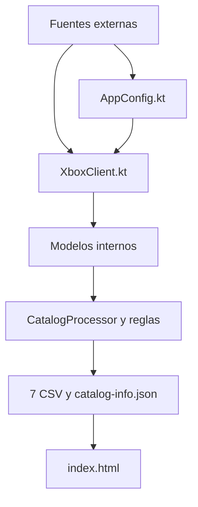

# Guía de adaptación ante cambios en las fuentes de datos

## 1. Propósito

Este documento explica cómo adaptar el generador Kotlin del proyecto **Xbox Game Pass Ultimate Clean List** cuando cambie alguno de los servicios externos usados para obtener los catálogos y metadatos de Xbox.

La guía cubre cambios como:

- nueva URL o servidor;
- cambio de parámetros, identificadores o encabezados HTTP;
- cambio del contrato de una API;
- cambio del formato JSON;
- autenticación nueva;
- paginación, límites de tamaño o rate limiting;
- respuestas incompletas o semánticamente diferentes;
- sustitución total de una fuente por otro proveedor;
- cambios que afecten títulos, precios, plataformas, Cloud o rutas de Xbox Store.

El objetivo principal es **absorber el cambio externo dentro de la capa de integración Kotlin** y conservar, siempre que sea posible, el contrato interno que consumen el procesamiento, los CSV, `catalog-info.json` y la VIEW.

---

## 2. Principio de diseño que debe conservarse

El proyecto tiene dos contratos diferentes:

1. **Contrato externo:** Xbox/SIGL/Display Catalog → Kotlin.
2. **Contrato interno:** Kotlin → modelos internos → CSV/JSON → VIEW.



La adaptación ideal modifica solamente `AppConfig.kt`, `XboxClient.kt` y sus pruebas. Si el cliente nuevo sigue entregando los mismos modelos internos, no deberían cambiar las reglas de negocio, los archivos publicados ni la VIEW.

---

## 3. Arquitectura actual de conexión

### 3.1 Archivos principales

| Archivo | Responsabilidad ante una fuente externa |
| --- | --- |
| `src/main/kotlin/com/ninnex/xboxgamepass/AppConfig.kt` | URLs, mercado, idioma, UUID de listas, contextos de plataforma y suscripción, timeout y número de intentos |
| `src/main/kotlin/com/ninnex/xboxgamepass/XboxClient.kt` | Construcción de requests, HTTP, reintentos, lectura del JSON, extracción de IDs y metadatos |
| `src/main/kotlin/com/ninnex/xboxgamepass/XboxGamePassGenerator.kt` | Orquesta las consultas, carga Cloud y metadatos, filtra Essential y ejecuta el procesamiento |
| `src/main/kotlin/com/ninnex/xboxgamepass/CatalogProcessor.kt` | Convierte las listas y metadatos en filas, combina plataformas y clasifica los juegos |
| `src/main/kotlin/com/ninnex/xboxgamepass/CatalogValidator.kt` | Valida el contrato final de los archivos generados |
| `src/main/kotlin/com/ninnex/xboxgamepass/CsvPublisher.kt` | Publica el conjunto validado y restaura los archivos anteriores si falla el reemplazo |
| `src/test/kotlin/com/ninnex/xboxgamepass/XboxClientTest.kt` | Comprueba requests y respuestas básicas del cliente Xbox |

### 3.2 Interfaz interna que aísla las fuentes

`XboxCatalogClient` expone actualmente tres operaciones:

```kotlin
interface XboxCatalogClient {
    fun loadSigl(source: CatalogSource, catalogName: String): PlatformProductIds
    fun loadCloudProductIds(): Set<String>
    fun loadProducts(productIds: List<String>): Map<String, ProductMetadata>
}
```

Esta interfaz es la frontera más importante. Si una nueva implementación puede seguir produciendo:

- `PlatformProductIds` para cada catálogo y plataforma;
- un conjunto normalizado de Product IDs con Cloud;
- `ProductMetadata` indexado por Product ID;

el resto del generador puede continuar funcionando sin conocer el nuevo formato externo.

---

## 4. Fuentes y contratos externos actuales

Los valores definitivos deben comprobarse siempre en `AppConfig.kt`, porque este documento puede quedar desactualizado después de una migración.

### 4.1 Catálogos SIGL

URL actual:

```text
https://catalog.gamepass.com/sigls/v3
```

Método y parámetros:

```text
GET /sigls/v3
    ?id={catalogListId}
    &language=en-us
    &market=US
    &platformContext={platformContext}
    &subscriptionContext={subscriptionContext}
```

Formato mínimo esperado actualmente:

```json
[
  { "id": "9ABCDEFGHIJK" },
  { "id": "9LMNOPQRSTUV" }
]
```

`XboxClient.extractProductIds()` exige un array y lee el campo textual `id`. Los valores se recortan, se convierten a mayúsculas y se deduplican.

### 4.2 Listas configuradas

| Catálogo | Plataforma | List ID | Platform context | Subscription context |
| --- | --- | --- | --- | --- |
| Ultimate | Console | `97c6c862-d28a-4907-a3d5-c401f2296a53` | `ConsoleGen8;ConsoleGen9` | `cfq7ttc0khs0` |
| Ultimate | PC | `97c6c862-d28a-4907-a3d5-c401f2296a53` | `pc` | `cfq7ttc0khs0` |
| Premium | Console | `09a72c0d-c466-426a-9580-b78955d8173a` | `ConsoleGen8;ConsoleGen9` | `cfq7ttc0p85b` |
| Premium | PC | `09a72c0d-c466-426a-9580-b78955d8173a` | `pc` | `cfq7ttc0p85b` |
| Essential | Console | `34031711-5a70-4196-bab7-45757dc2294e` | `ConsoleGen8;ConsoleGen9` | `cfq7ttc0k5dj` |
| Essential | PC | `34031711-5a70-4196-bab7-45757dc2294e` | `pc` | `cfq7ttc0k5dj` |
| EA Play | Console | `b8900d09-a491-44cc-916e-32b5acae621b` | `ConsoleGen8;ConsoleGen9` | `cfq7ttc0khs0` |
| EA Play | PC | `1d33fbb9-b895-4732-a8ca-a55c8b99fa2c` | `pc` | `cfq7ttc0khs0` |
| Ubisoft+ Classics | Console | `66ec875c-a391-44f5-9a54-a28bd6f976ce` | `ConsoleGen8;ConsoleGen9` | `cfq7ttc0khs0` |
| Ubisoft+ Classics | PC | `66ec875c-a391-44f5-9a54-a28bd6f976ce` | `pc` | `cfq7ttc0khs0` |

Los UUID anteriores son identificadores de listas y deben permanecer como configuración explícita y versionada. No deben convertirse en valores aleatorios.

### 4.3 Xbox Cloud Gaming

Cloud utiliza el mismo endpoint SIGL, pero con otra lista y contexto:

```text
List ID:              29a81209-df6f-41fd-a528-2ae6b91f719c
Platform context:     ConsoleGen8;ConsoleGen9;pc
Subscription context: cfq7ttc0khs0
```

La respuesta se transforma en `Set<String>` y se relaciona con las filas por Product ID exacto normalizado. Cloud no debe confundirse con soporte nativo de consola o PC.

### 4.4 Display Catalog

URL actual:

```text
https://displaycatalog.mp.microsoft.com/v7.0/products
```

Request actual:

```text
GET /v7.0/products
    ?bigIds={productId1,productId2,...}
    &market=US
    &languages=en-us
    &MS-CV={correlationVector}
```

Contrato mínimo utilizado:

```json
{
  "Products": [
    {
      "ProductId": "9ABCDEFGHIJK",
      "LocalizedProperties": [
        { "ProductTitle": "Example Game" }
      ],
      "DisplaySkuAvailabilities": []
    }
  ]
}
```

El cliente utiliza esta respuesta para obtener:

- `ProductId`;
- `LocalizedProperties[0].ProductTitle`;
- una URL oficial estructurada cuando existe;
- información de precio dentro de `DisplaySkuAvailabilities`.

Si no encuentra una URL estructurada, genera la ruta oficial `-/PRODUCT_ID`.

`MS-CV` sí es un Correlation Vector nuevo para cada request. No es un identificador fijo de catálogo.

### 4.5 Comportamiento HTTP actual

- timeout de conexión y request: 60 segundos;
- hasta 3 intentos;
- seguimiento de redirects normales;
- espera incremental entre reintentos;
- `Accept: application/json`;
- `Cache-Control: no-store`;
- `User-Agent: xbox-gamepass-csv-generator/1.0`;
- solo acepta códigos HTTP entre 200 y 299.

---

## 5. Contrato interno que debe conservarse

Una modificación externa no debería cambiar automáticamente este contrato.

### 5.1 Archivos publicados

| Archivo | Columnas |
| --- | --- |
| `data/ultimate.csv` | `name,productId,console,pc,cloud,category,storePath,newSinceDate` |
| `data/premium.csv` | `name,productId,console,pc,cloud,category,storePath,newSinceDate` |
| `data/essential.csv` | `name,productId,console,pc,cloud,category,storePath,newSinceDate` |
| `data/ea-play.csv` | `name,productId,console,pc,cloud,storePath,newSinceDate` |
| `data/ubisoft-plus.csv` | `name,productId,console,pc,cloud,storePath,newSinceDate` |
| `data/ultimate-no-premium.csv` | `name,productId,console,pc,cloud,category,storePath,newSinceDate` |
| `data/ultimate-exclusive.csv` | `name,productId,console,pc,cloud,category,storePath,newSinceDate` |

Todos los CSV deben conservar:

- UTF-8 sin BOM;
- terminaciones LF;
- encabezado exacto;
- `true` y `false` en minúsculas;
- Product IDs de 12 caracteres alfanuméricos en mayúsculas;
- una ruta de Store válida que termine en el Product ID;
- `newSinceDate` vacío o con formato `YYYY-MM-DD`.

### 5.2 `catalog-info.json`

Campos actuales:

```json
{
  "xboxStoreBaseUrl": "https://www.xbox.com/en-US/games/store/",
  "newGameDisplayDays": 20,
  "lastCheckedAt": "2026-08-09T00:00:00Z",
  "changesFound": true
}
```

### 5.3 Dependencias semánticas que no son evidentes

- Cloud se compara por Product ID.
- El filtrado de juegos gratuitos de Essential depende de que el precio pueda clasificarse con seguridad como `FREE` o `PAID`.
- La unión de PC y consola y la clasificación entre catálogos utilizan actualmente el `ProductTitle` exacto.
- Cambios de capitalización, idioma, puntuación o título pueden alterar clasificaciones aunque el JSON siga siendo válido.
- `newSinceDate` se conserva por lista; no es una propiedad global del juego.

Por lo tanto, un cambio semántico en `ProductTitle` o precios puede ser más peligroso que un cambio visible de URL.

---

## 6. Diagnóstico inicial cuando falle el workflow

Antes de modificar código:

1. Identificar la primera operación que falló: SIGL, Cloud, Display Catalog, validación, publicación o despliegue.
2. Registrar URL base, parámetros no sensibles, código HTTP y mensaje de error.
3. Obtener una muestra pequeña de la respuesta nueva, eliminando tokens o secretos.
4. Comparar la respuesta con el contrato descrito en la sección 4.
5. Confirmar si el problema ocurre en todos los catálogos o solamente en una lista/plataforma.
6. Ejecutar `./mvnw --batch-mode verify` para separar errores de código y errores de integración.
7. No modificar los CSV publicados manualmente para ocultar el fallo.

### Clasificación rápida

| Síntoma | Cambio probable |
| --- | --- |
| `404` o DNS | URL, versión o servidor cambiado |
| `401` o `403` | autenticación, permisos, headers o bloqueo del cliente |
| `429` | rate limit o demasiada concurrencia |
| `400` | parámetros, nombres, codificación o tamaño de URL incorrectos |
| `5xx` | indisponibilidad temporal del proveedor |
| “is not a list” | cambió el contenedor de la respuesta SIGL |
| “Display Catalog has an invalid response” | desapareció o cambió `Products` |
| Product IDs faltantes | paginación, límite, respuesta parcial o IDs nuevos/no compatibles |
| precio desconocido en Essential | cambió `DisplaySkuAvailabilities` o la semántica de precios |
| categorías inesperadas | cambió `ProductTitle`, el idioma o la pertenencia de las listas |
| catálogo mucho más pequeño sin error | respuesta válida pero incompleta |

---

## 7. Procedimiento general de adaptación

### Paso 1: preservar el último estado válido

- No sobrescribir `data/` con una ejecución fallida o parcial.
- Trabajar en una rama separada.
- Conservar una muestra de la respuesta anterior y otra de la respuesta nueva como fixtures de prueba.
- No incluir secretos reales en fixtures, commits o logs.

### Paso 2: determinar el alcance real

Responder estas preguntas:

1. ¿Cambió solamente la dirección del servidor?
2. ¿Cambió el request: método, parámetros, headers o body?
3. ¿Cambió el JSON, XML u otro formato de respuesta?
4. ¿Cambió el significado de los campos aunque tengan el mismo nombre?
5. ¿La respuesta ahora está paginada o dividida en lotes?
6. ¿Se necesita autenticación?
7. ¿Sigue existiendo un identificador estable equivalente al Product ID?
8. ¿La nueva fuente distingue PC, consola y Cloud?
9. ¿Suministra título, precio y URL de Store con precisión suficiente?

### Paso 3: adaptar la frontera externa

Orden recomendado:

1. Actualizar constantes y definiciones en `AppConfig.kt`.
2. Adaptar la construcción del request en `XboxClient.kt`.
3. Adaptar el parser externo.
4. Normalizar la información nueva a los modelos internos existentes.
5. Evitar modificar `CatalogProcessor`, `CsvWriter` o `index.html` si el cambio es solamente externo.

### Paso 4: actualizar pruebas antes de publicar

Como mínimo, agregar casos para:

- request correcto;
- respuesta válida mínima;
- respuesta completa representativa;
- array u objeto vacío;
- campo requerido ausente;
- tipo incorrecto;
- IDs duplicados, vacíos o con espacios;
- producto solicitado que no aparece en la respuesta;
- producto inesperado;
- paginación o varios lotes, si existen;
- precio gratuito, pagado y desconocido;
- rate limit o error HTTP, si se agrega manejo especializado.

### Paso 5: validar el contrato interno

Ejecutar:

```bash
./mvnw --batch-mode verify
```

Después generar en un directorio candidato comparándolo con la publicación actual:

```bash
./mvnw --batch-mode exec:java -Dexec.args="build/generated-data data"
```

No usar directamente `data/` como primer destino durante una migración.

### Paso 6: revisar diferencias

Comprobar:

- cantidad de filas por catálogo;
- cantidad por PC, consola y Cloud;
- juegos añadidos y retirados;
- cambios de Product ID;
- cambios de título;
- cambios de categoría;
- cantidad de gratuitos excluidos de Essential;
- rutas de Store modificadas;
- valores de `newSinceDate` preservados;
- ausencia de duplicados.

### Paso 7: ejecutar una prueba controlada del workflow

- Ejecutar manualmente el workflow en la rama o entorno permitido.
- Verificar que no se publiquen datos si falla una consulta o validación.
- Confirmar que el despliegue contiene exactamente `index.html`, los siete CSV y `catalog-info.json`.
- Revisar la VIEW en escritorio y móvil antes de integrar a `main`.

---

## 8. Adaptación por tipo de cambio

### 8.1 Solo cambia la URL

Archivos probables:

- `AppConfig.kt`;
- `XboxClientTest.kt` si verifica la URI exacta;
- documentación.

Si el método, parámetros y respuesta no cambian, no deberían tocarse el parser ni los modelos.

### 8.2 Cambian List IDs o contextos

Actualizar `AppConfig.catalogs` o la configuración de Cloud. Confirmar por separado PC y consola, porque compartir un List ID no garantiza que ambos contextos devuelvan lo mismo.

No reemplazar UUID fijos con valores aleatorios. Documentar de dónde proviene cada identificador y qué suscripción representa.

### 8.3 Cambia el campo `id` de SIGL

Ejemplo anterior:

```json
[{ "id": "9ABCDEFGHIJK" }]
```

Ejemplo nuevo hipotético:

```json
{
  "items": [
    { "product": { "productId": "9ABCDEFGHIJK" } }
  ]
}
```

La adaptación debe transformar el formato nuevo al mismo conjunto normalizado de Product IDs:

```kotlin
private fun extractProductIds(data: JsonNode, label: String): LinkedHashSet<String> {
    val items = data.get("items")
    check(items?.isArray == true) { "$label has an invalid items collection." }

    return items.mapNotNullTo(linkedSetOf()) { item ->
        item.path("product").path("productId")
            .takeIf(JsonNode::isTextual)
            ?.asText()
            ?.trim()
            ?.takeIf(String::isNotEmpty)
            ?.uppercase(Locale.ROOT)
    }
}
```

Este código es solo un ejemplo. Debe implementarse contra una respuesta real y acompañarse de fixtures y pruebas.

### 8.4 Cambia `Products` o sus campos internos

Revisar principalmente:

- `loadProductSet()`;
- `addResolvedProduct()`;
- `findStructuredStorePath()`;
- `ProductPriceClassifier`.

Mantener como salida:

```kotlin
ProductMetadata(
    productId = normalizedProductId,
    productTitle = normalizedTitle,
    storePath = validStorePath,
    priceStatus = FREE_OR_PAID,
)
```

Si la nueva fuente no permite determinar el precio de Essential de manera segura, la generación debe fallar. No debe asumirse que un precio desconocido es pagado.

### 8.5 La API agrega paginación

La operación debe:

1. solicitar todas las páginas;
2. detenerse únicamente cuando el contrato indique que no quedan páginas;
3. detectar cursores repetidos para evitar ciclos;
4. deduplicar Product IDs;
5. validar que ninguna página haya fallado;
6. devolver un resultado único solo después de completar todas las páginas.

Nunca publicar solamente la primera página.

### 8.6 Display Catalog limita el tamaño del request

Actualmente los IDs se envían juntos mediante `bigIds`. Si aparece un límite de URL o de cantidad:

1. dividir IDs en lotes deterministas;
2. consultar todos los lotes;
3. combinar por Product ID;
4. rechazar duplicados contradictorios;
5. comprobar que `requestedIds == resolvedIds`;
6. publicar solamente cuando todos los lotes terminen correctamente.

### 8.7 Se requiere autenticación

Cambios necesarios:

- definir el mecanismo en el cliente HTTP;
- almacenar secretos en GitHub Actions Secrets, nunca en el repositorio;
- evitar tokens en URLs, logs y excepciones;
- implementar renovación si el token expira;
- agregar pruebas con credenciales falsas;
- documentar permisos mínimos y procedimiento de rotación.

Si la fuente requiere una cuenta personal o términos incompatibles con la automatización, evaluar la viabilidad antes de implementar.

### 8.8 Aparece rate limiting

Ante `429`:

- respetar `Retry-After` cuando exista;
- utilizar backoff exponencial con un máximo;
- reducir concurrencia si el límite es global;
- agregar jitter para evitar reintentos sincronizados;
- limitar el número total de intentos;
- fallar sin publicar si no se completa el conjunto.

El `Executor` actual puede lanzar las diez consultas SIGL concurrentemente. Una nueva fuente podría no permitir ese nivel de paralelismo.

### 8.9 La fuente devuelve datos incompletos pero válidos

Este es el escenario más peligroso porque puede superar las validaciones estructurales.

Agregar controles como:

- caída máxima permitida por catálogo;
- mínimo esperado por plataforma;
- alerta si PC o consola pasa repentinamente a cero;
- alerta por variación anormal de Cloud;
- porcentaje máximo de productos sin metadata;
- comparación con el catálogo publicado anterior;
- modo de aprobación manual para una reducción excepcional legítima.

Estas validaciones comparativas son una recomendación de endurecimiento; no deben considerarse implementadas mientras no existan en el código y sus pruebas.

### 8.10 Cambian títulos o idioma

El proyecto utiliza `en-us` y compara `ProductTitle` exacto entre catálogos. Si cambia el título de una lista pero no el de otra, un mismo juego puede parecer diferente y recibir una categoría incorrecta.

Antes de aceptar un cambio de idioma o fuente de títulos:

- comparar los títulos por Product ID;
- detectar varios títulos para el mismo producto;
- revisar diferencias de edición, puntuación y sufijos;
- considerar migrar la clasificación entre catálogos a Product ID cuando sea técnicamente correcto;
- agregar pruebas para juegos con títulos iguales y Product IDs diferentes, y viceversa.

### 8.11 Se reemplaza completamente la fuente

Crear preferiblemente una implementación nueva de `XboxCatalogClient` o separar adaptadores por proveedor. La nueva fuente debe demostrar equivalencia para:

- pertenencia a Ultimate, Premium, Essential, EA Play y Ubisoft+;
- PC y consola por separado;
- Cloud;
- Product ID estable;
- título oficial;
- precio necesario para Essential;
- ruta oficial de Store.

Si falta alguna capacidad, documentar explícitamente qué regla de negocio deja de ser confiable antes de integrar.

---

## 9. Política de fallos y publicación segura

La política debe seguir siendo **fail closed**:

- una consulta requerida fallida cancela la generación;
- una respuesta vacía o inválida cancela la generación;
- productos sin resolver cancelan la generación;
- precios desconocidos de Essential cancelan la generación;
- archivos inválidos no se publican;
- un fallo durante el reemplazo restaura los bytes anteriores;
- el workflow no despliega un conjunto parcial.

El sitio puede continuar mostrando la última publicación válida. Es preferible información temporalmente desactualizada y claramente fechada que un catálogo nuevo incompleto o corrupto.

---

## 10. Pruebas recomendadas

### 10.1 Pruebas unitarias del adaptador

- URI, método, parámetros y headers exactos;
- normalización a mayúsculas;
- deduplicación;
- arrays, objetos y campos inválidos;
- extracción de título y Product ID;
- rutas oficiales estructuradas y fallback `-/PRODUCT_ID`;
- precios `FREE`, `PAID` y `UNKNOWN`;
- Cloud vacío e inválido;
- respuesta parcial de metadatos;
- productos inesperados.

### 10.2 Pruebas de contrato con fixtures

Guardar respuestas anonimizadas o públicas pequeñas en `src/test/resources/`. Cada fixture debe representar una versión concreta del contrato externo y no contener tokens.

Conviene mantener:

- último contrato conocido válido;
- nuevo contrato durante una migración;
- respuestas de error relevantes;
- casos reales difíciles de precio y Store URL.

### 10.3 Pruebas del pipeline completo

Con un `XboxCatalogClient` falso:

- generar los ocho artefactos;
- confirmar encabezados y valores;
- comprobar clasificaciones;
- comprobar exclusión de gratuitos de Essential;
- comprobar Cloud por Product ID;
- conservar fechas históricas;
- verificar que no se escriban archivos ante un fallo.

---

## 11. Checklist antes de integrar una adaptación

- [ ] Se identificó y documentó el cambio externo real.
- [ ] No se incluyeron secretos en código, fixtures o logs.
- [ ] `AppConfig.kt` contiene las URLs e identificadores vigentes.
- [ ] El cliente transforma la respuesta nueva a los modelos internos existentes.
- [ ] Se conservan Product IDs normalizados.
- [ ] Se verificaron PC, consola y Cloud por separado.
- [ ] Se verificó el significado del precio usado por Essential.
- [ ] Se revisaron cambios de títulos y categorías.
- [ ] Se agregaron pruebas del contrato nuevo.
- [ ] `./mvnw --batch-mode verify` termina correctamente.
- [ ] Se generó primero en `build/generated-data`.
- [ ] Se compararon cantidades y diferencias con `data/`.
- [ ] Los siete CSV conservan su esquema.
- [ ] `catalog-info.json` conserva su esquema.
- [ ] La VIEW carga todos los result sets sin errores.
- [ ] Un fallo simulado no reemplaza los datos válidos.
- [ ] Se actualizó la documentación técnica.
- [ ] Se ejecutó una prueba manual del workflow antes de confiar en la programación diaria.

---

## 12. Cambios que no deben hacerse como atajo

- No desactivar validaciones para hacer pasar una respuesta nueva.
- No tratar una respuesta vacía como un catálogo legítimamente vacío sin confirmación.
- No asumir que `UNKNOWN` significa juego pagado.
- No publicar páginas o lotes parciales.
- No cambiar simultáneamente el contrato externo y el contrato CSV sin necesidad.
- No hacer que `index.html` consulte directamente la nueva API externa.
- No exponer claves o tokens en JavaScript o GitHub Pages.
- No convertir UUID de listas en valores aleatorios.
- No confundir Cloud con disponibilidad nativa de PC o consola.
- No considerar dos juegos iguales solamente porque sus títulos se parecen.

---

## 13. Posible mejora arquitectónica futura

Si las fuentes empiezan a cambiar con frecuencia, puede separarse `XboxClient` en adaptadores más pequeños:

```text
CatalogMembershipSource
  └── SiglCatalogSource

CloudMembershipSource
  └── SiglCloudSource

ProductMetadataSource
  └── MicrosoftDisplayCatalogSource

XboxCatalogClient
  └── Coordinador que combina los adaptadores
```

Ventajas:

- cada contrato externo tiene su propio parser y pruebas;
- una migración de metadatos no afecta las listas SIGL;
- puede coexistir temporalmente un adaptador anterior y uno nuevo;
- se pueden comparar ambas fuentes antes de cambiar;
- los reintentos, rate limits y autenticación pueden configurarse por proveedor.

Esta refactorización no es obligatoria para un cambio simple de URL o campo. Debe hacerse cuando la frecuencia o complejidad de los cambios justifique el costo.

---

## 14. Registro recomendado para cada migración

Añadir a la documentación o al pull request:

```text
Fecha:
Fuente afectada:
Contrato anterior:
Contrato nuevo:
Causa del cambio:
Archivos Kotlin modificados:
Pruebas agregadas:
Cantidad anterior y nueva por catálogo:
Impacto en PC/Console/Cloud:
Impacto en Essential y precios:
Impacto en CSV/JSON:
Plan de rollback:
Resultado del workflow manual:
```

Con este registro, una migración futura puede distinguir rápidamente una decisión intencional de una regresión.

---

## 15. Resumen operativo

Ante un cambio externo:

1. detener la publicación del resultado dudoso;
2. capturar y comparar el contrato anterior y el nuevo;
3. adaptar `AppConfig.kt` y/o `XboxClient.kt`;
4. normalizar al mismo modelo interno;
5. agregar fixtures y pruebas;
6. generar en un directorio candidato;
7. comparar cantidades, plataformas, títulos, precios y categorías;
8. conservar el contrato de los siete CSV y `catalog-info.json`;
9. probar el workflow manualmente;
10. integrar solamente cuando el pipeline completo falle de forma segura y produzca resultados equivalentes.

